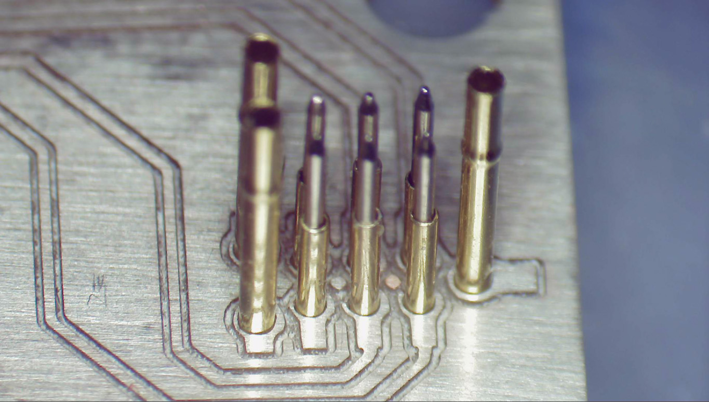
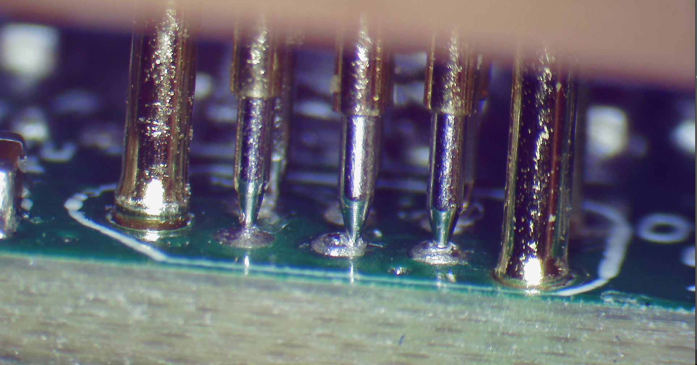

## OSHconnect

This is a footprint suitable to put on a PCB to create a compatible pogo pin jig to a similar commercial product.
The parts used are `P50-B1` pogo pins and pogo pins sleeves. The sleeves are really hard to find so you can also use the same P50 pogo pins (maybe with a flat tip instead the pointy B1) and reverse mount them.

